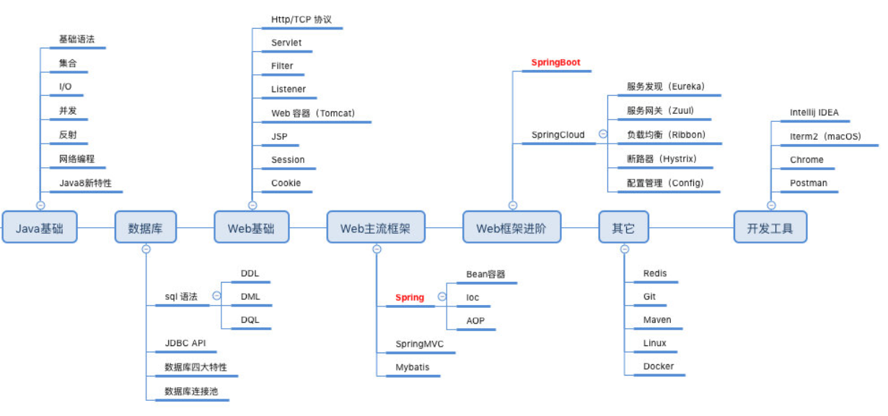
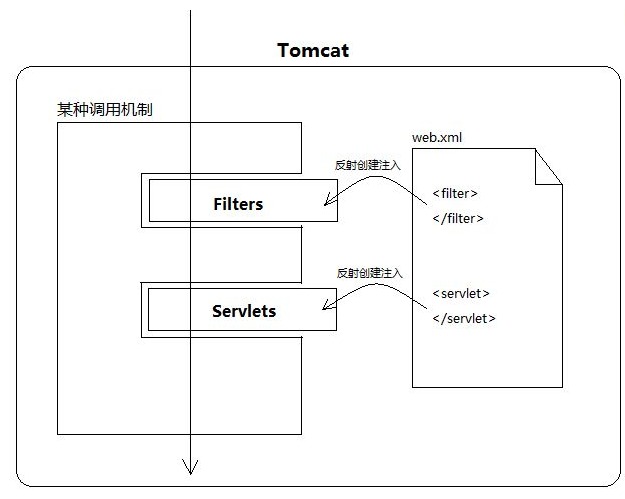
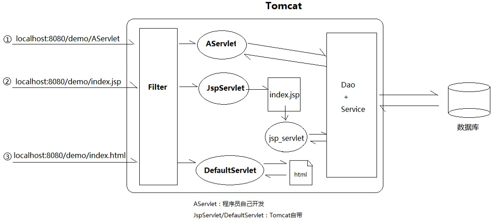

## 规范

### 大纲




- JavaSE
- SSH
- SSM
- 前后端分离


### JDK和Maven安装

略


### JavaSE

Java基础

- 集合

- I/O

- 并发

- 反射

- 网络编程

- Java8,9,10新特性

  

### Servlet

Servlet是运行在web服务器端（web容器,如tomcat）的程序，本质是实现了javax.servlet.Servlet接口的Java类。

Servlet的主要作用是处理客户端的请求，并把处理结果响应给客户端。生成动态网页。

```java
// Servlet接口
public interface Servlet {
    //初始化
    void init(ServletConfig var1) throws ServletException;

    // 每个servlet拥有一个ServletConfig对象
    ServletConfig getServletConfig();

    /** 
    	service（）是执行实际任务的主要方法。
    	Servlet 容器（tomcat）调用 service方法来处理来自客户端（浏览器）的请求，
    	并把格式化的响应写回给客户端
    */
    void service(ServletRequest var1, ServletResponse var2) 
        throws ServletException, IOException;

    //提供有关servlet的信息，如作者、版本、版权
    String getServletInfo();

    //销毁
    void destroy();
}
```


当容器（Tomcat）启动时，会读取在webapps目录下所有的web应用中的web.xml文件，然后对 **xml文件进行解析，并读取servlet注册信息**。然后，将每个应用中注册的servlet类都进行加载，并通过 **反射的方式实例化**。（有时候也是在第一次请求时实例化）







**HttpServletRequest**：封装了与请求相关的信息

**HttpServletResponse**：封装了与响应相关的信息

例子：

```java
public class RequestDemo extends HttpServlet {
 
   public void doGet(HttpServletRequest request, HttpServletResponse response)
           throws ServletException, IOException {
       //设置将字符以"UTF-8"编码输出到客户端浏览器
       response.setCharacterEncoding("UTF-8");
       response.setHeader("content-type", "text/html;charset=UTF-8");
       PrintWriter out = response.getWriter();
       Enumeration<String> reqHeadInfos = request.getHeaderNames();//获取所有的请求头
       out.write("<hr/>");
       //获取Accept-Encoding请求头对应的值
       String value = request.getHeader("Accept-Encoding");
       out.write(value);
   }
 
   public void doPost(HttpServletRequest request, HttpServletResponse response)
           throws ServletException, IOException {
       doGet(request, response);
   }
 
}
```


### Spring

Spring是一个容器，包含并管理对象的生命周期和配置。Spring的核心就是IOC和AOP

**IOC 容器**

- **容器**：在传统的开发模式下，我们都是采用直接 new 一个对象的方式来创建对象，也就是说你依赖的对象直接由你自己控制，但是有了 IOC 容器后，则直接由 IoC 容器来控制。所以“谁控制谁”，当然是 IoC 容器控制对象。

- **控制什么**：控制对象。

- **为何是反转**：没有 IoC 的时候我们都是在自己对象中主动去创建被依赖的对象，这是正转。但是有了 IoC 后，所依赖的对象直接由 IoC 容器创建后注入到被注入的对象中，依赖的对象由原来的主动获取变成被动接受，所以是反转。

- **哪些方面反转了**：所依赖对象的获取被反转了。

**AOP 面向切面编程**

代理模式

```java
public interface Controller {
    void doing();
}
```

```java
public class MyController implements Controller {

    @Override
    public void doing() {
        System.out.println("test");
    }
}

public class MyProxy implements Controller {
    private MyController myController;
    public  MyProxy(Controller c) {
        myController = (MyController)c;
    }

    @Override
    public void doing() {
        System.out.println("before doing...");
        myController.doing();
        System.out.println("before doing...");
    }
}

```

```java
    public static void main(String[] args) {
        MyController m = new MyController();
        MyProxy p = new MyProxy(m);

        p.doing();
    }
```


动态代理


### SSM

SSM（Spring+SpringMVC+MyBatis）框架集由Spring、SpringMVC、MyBatis三个开源框架整合而成，常作为数据源较简单的web项目的框架。

SpringMVC分离了控制器、模型对象、分派器以及处理程序对象的角色，这种分离让它们更容易进行定制。

MyBatis是一个支持普通SQL查询，存储过程和高级映射的优秀持久层框架。


### Spring Boot

SSM是WEB应用框架，涵盖整个应用层，而spring boot你可以看做一个启动、配置、快速开发的辅助框架，本身针对的是微服务。

> 从本质上来说，Spring Boot就是Spring,它做了那些没有它你也会去做的Spring Bean配置。它使用“习惯优于配置”（项目中存在大量的配置，此外还内置了一个习惯性的配置，让你无需手动进行配置）的理念让你的项目快速运行起来。使 用Spring Boot很容易创建一个独立运行（运行jar,内嵌Servlet容器）、准生产级别的基于Spring框架的项目，使用Spring Boot你可以不用或者只需要很少的Spring配置。


### Spring Cloud


### 常用注解


### Mybatis


### 开发模式


### 日志规范


### 部署

